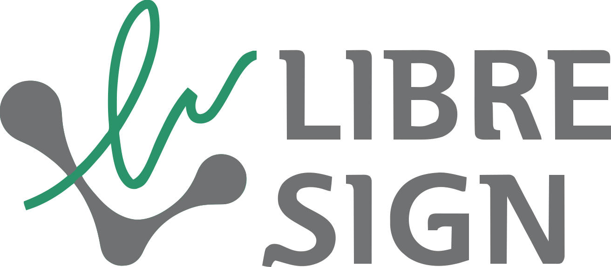

<!--
SPDX-FileCopyrightText: 2026 LibreSign contributors
SPDX-License-Identifier: CC-BY-SA-4.0
-->

  

# LibreSign brand

Canonical, version-controlled source for the current LibreSign brand system.

Public guide: https://libresign.coop/brand

## Brand manual formats

The brand manual is published in two PDF layouts generated from the same canonical Typst source and the same brand rules:

| Format | Intended use | Latest build |
| --- | --- | --- |
| A4 portrait | Document-oriented reading, review, and printing | [LibreSign brand manual — A4](https://github.com/LibreSign/brand/releases/download/latest/libresign-brand-manual.pdf) |
| 16:9 widescreen | Screen-oriented reading and presentation | [LibreSign brand manual — 16:9](https://github.com/LibreSign/brand/releases/download/latest/libresign-brand-manual-slides.pdf) |

The 16:9 edition is not a separate manual or an abridged speaker deck. Both formats are rendered from `manual/main.typ`; only the layout adapts to the target page ratio. Some topics may therefore span more than one 16:9 page.

## Contract

- This repository contains the **current** brand system.
- Canonical artwork lives under `source/artwork/`.
- PNG/PDF derivatives are generated from canonical SVG source by CI.
- The repository-level `LICENSE` is **CC BY-SA 4.0**, the primary license for documentation and official artwork.
- Build scripts and automation are licensed under **AGPL-3.0-or-later**.
- Third-party fonts keep their upstream licenses.
- Per-file SPDX metadata and `LICENSES/` remain authoritative where a file uses a different license.
- Trademark permission is governed separately by `TRADEMARKS.md`.

## Layout

- `guidelines/` — normative brand rules.
- `source/artwork/` — canonical editable artwork.
- `assets/` — generated-asset policy and build contract.
- `manual/` — Typst source.
- `docs/` — architecture, decisions, and references.
- `LICENSES/` and `REUSE.toml` — licensing metadata.

## Migration status

The former design-tool/manual workflow has been replaced by this open, version-controlled system.

- editable brand rules are plain text and Typst;
- the official logo source is SVG;
- public derivatives are generated reproducibly;
- the PDF manual is built as PDF/UA-1 and checked in CI;
- releases are published from the same source tree.

Do not reintroduce a separate proprietary design file as a second source of truth.
